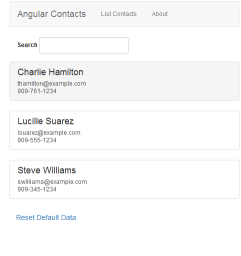

# sample-wch-script-application

Sample script application that can be deployed and rendered in the [wch-site-application](https://github.com/ibm-wch/wch-site-application) SPA.



## Table of Contents
- [Table of Contents](#table-of-contents)
- [Configure and deploy the script application](#configure-and-deploy-the-script-application)
  - [Configure your wchtools](#configure-your-wchtools)
  - [Deploy the script application](#deploy-the-script-application)
- [How to configure your own script application](#how-to-configure-your-own-script-application)
- [Accessing the renderingContext in your script application](#accessing-the-renderingcontext-in-your-script-application)
- [License](#license)

## Configure and deploy the script application

### Configure your wchtools
* Get your WCH tenant API URL. Go to your WCH homepage -> YOUR USERNAME tab on top bar -> Hub information -> API URL. Copy the URL.
* Run `wchtools init` in your command line. Enter your username and API URL when prompted to configure the wchtools cli tool

### Deploy the script application
From the command line, navigate to the content-artifacts directory of this repository and run:
* `wchtools push -Afv` this will push all the necessary files to run the script application on the site

## How to configure your own script application
Each script application will follow a certain file structure:
 * content-artifacts - root directory to contain files for this script application
   * assets - WCH web assets folder
     * dxconfig - WCH config folder
       * \<ContentTypeName\>.json - JSON config file for the script application
     * scriptApps - directory that contains the script application
   * layout-mappings - WCH layout mappings folder
     * \<content-type-name\>-layout-mapping.json - WCH layout mapping file that links the content type to the code to render the script application in the SPA
   
1. Create a new content type on WCH. Make a note the name that you use.
2. In the assets/dxconfig folder, add a new JSON file with the same name as your WCH content type, created in step 1.
  * The JSON object will contain one property 'path', that will be the relative path from the web assets directory to the kicker index.html file for your script application. This will tell WCH what file needs to be loaded in order to run the script application:
  
  e.g.
  ```
{
  "path": "scriptApps/myScriptApp/index.html"
}
  ```
3. Add your script application code to the web assets folder, in the directory that matches the `"path"` property of the JSON file from step 2.
4. Configure the layout mapping file for the script application
  * The layout mapping file will link the content type to the code to render the script application.
  * The layout mapping file must follow the following template, replacing anything surrounded by `<>` with the values of the content type from step 1:
  ```
{
  "id": "<content-type-name>-layout-mapping",
  "name": "<ContentTypeName>LayoutMapping",
  "classification": "layout-mapping",
  "type": {
    "name": "<ContentTypeName>"
  },
  "mappings": [
    {
      "defaultLayout": {
        "id": "script-app-layout",
        "name": "scriptAppLayout"
      },
      "layouts": [
        {
          "id": "script-app-layout",
          "name": "scriptAppLayout"
        }
      ]
    }
  ]
}
```
5. Push the files to WCH:
  * From a command line, change directories to the newly created content-artifacts directory and run `wchtools push -Afv'

After all steps have been completed, the script application content item can be added to the your site, like any other content item.


## Accessing the renderingContext in your script application
Though script applications can be rendered without making use of the content type elements, it is easy to integrate them into your script application and enable the business user to configure the script applicaiton. HTML5 messaging is leveraged to send information to and from the script application. Inside the [wchService.js](content-artifacts/assets/scriptApps/AngularContacts/js/wchService.js) file, you can see an example of how this is done.
```
var renderingContext = {};
var parentOrigin = '*';

function updateRenderingContext(event) {
  if (event.data.message === 'updated renderingContext') {
    renderingContext = event.data.renderingContext;
    parentOrigin = event.origin
  }
}

window.addEventListener("message", updateRenderingContext, false);

function requestRenderingContext() {
  window.parent.postMessage({
    message: 'update renderingContext'
  }, parentOrigin );
}

function requestResizeFrame(newHeight) {
  window.parent.postMessage({
    message: 'resize iFrame',
    height: newHeight
  }, parentOrigin );
}

requestRenderingContext();
```

* renderingContext - a global variable that will be updated every time that a postMessage event is sent (when the renderingContext is updated) to the script applicaiton with a message of `"updated renderingContext"` 
* requestRenderingContext() - a global function that will send a postMessage to the SPA, requesting an updated renderingContext
* requestResizeFrame(newHeight) - a global function that will send a postMessage to the SPA, requesting the frame element to resize to fit the height provided by `newHeight`

If you prefer, you can import these functions into your application by copying the [wchService.js](content-artifacts/assets/scriptApps/AngularContacts/js/wchService.js) file into your script application code directory and adding
a script tag right before the `</body>` tag of the kicker html file.
e.g. `<script src="path/to/wchService.js"></script>`


Once added, you can access the renderingContext and all its properties from inside your application. The sample script application in this repository demonstrates how to make use of it in an AngularJS app.

## License
See the included license file [License](license.txt) .

[back to top](#sample-wch-script-application)
